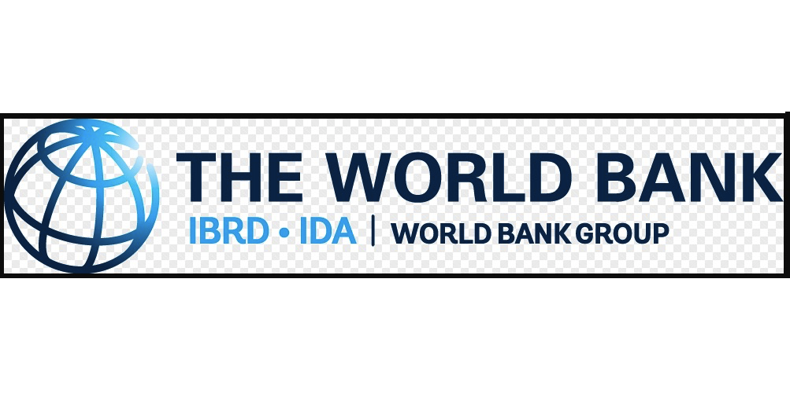

# Business-Intelligence-Project-World-Bank-Recommendation-System

This project was part of the 'Business Intelligence and Data Warehousing' course.
- Cleaned and Merged datasets using python and Excel for data uniformity.
- Did data modelling using Erwin for a normalized schema from two bodies (IBRD & IDA) of World Bank.
- Data Extraction, Loading & Transformation (ETL) done using Pentaho.
- Analyzing the financial capacity of the borrower and Visualizing the same using Tableau to avoid frauds and losses based on features like date & Principle borrowed, timeframe for repayment and the type of project the countries need loan for.
- Represented using Tableau.
